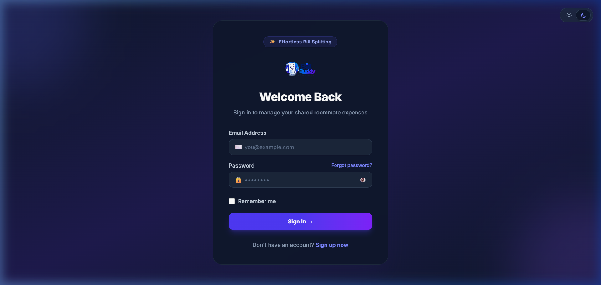
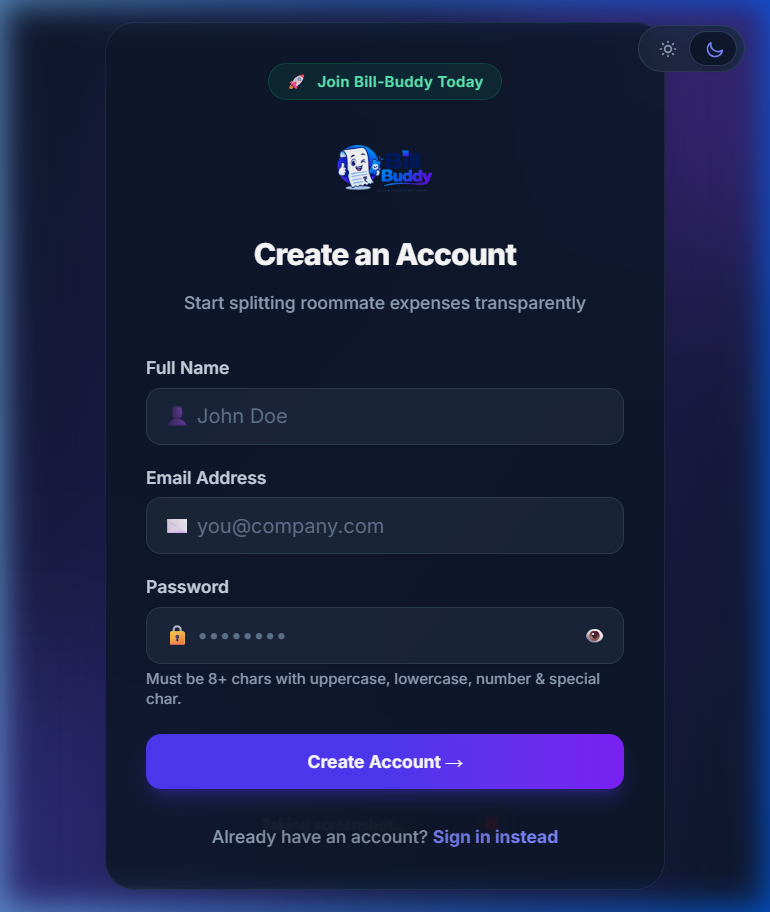
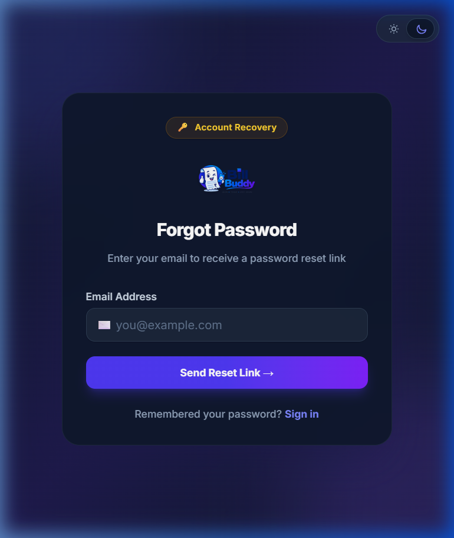

# 💰 Bill-Buddy (Split with Roommates)

**Bill-Buddy** is a modern, full-stack expense-sharing web application designed to help roommates and friends effortlessly track shared expenses, split bills, manage groups, and settle balances in real-time.

---

## 🚀 Tech Stack

### **Backend**
- **Language & Framework:** Java 17, Spring Boot 3.4.3
- **Database:** MySQL / Spring Data JPA & Hibernate
- **Documentation:** OpenAPI 3.0 / Swagger UI (`springdoc-openapi-starter-webmvc-ui`)
- **Utilities & Tools:** Lombok, Spring Mail, Maven

### **Frontend**
- **Framework & Build Tool:** React 19, Vite 6
- **Styling:** Tailwind CSS 4, Glassmorphism, Theme Context (Dark/Light Mode)
- **Routing & State:** React Router v7, Axios, React Toastify

---

## ✨ Key Features

- 👤 **User Management & Modern Auth UI**: Glassmorphic Sign-up, Login, and Forgot/Reset Password flows.
- ☀️ **Dark & Light Mode Switcher**: Animated dual-segment theme toggle with persistent user preference.
- 👥 **Group Management**: Create roommate/friend groups and add members seamlessly.
- 🧾 **Expense Tracking & Pagination**: Log joint expenses with instant search filtering and table pagination.
- ⚖️ **Balance Settlement**: Automated debt calculation showing who owes what to whom.
- 📄 **API Documentation**: Interactive Swagger API docs built into the backend server.

---

## 📸 Screenshots & Visual Overview

### **Modern Login Screen**


### **Account Registration Screen**


### **Forgot Password & Recovery Flow**


---

## 📁 Repository Structure

```text
bill-buddy/
├── backend/                  # Spring Boot REST API
│   ├── src/                  # Source code (Controllers, Services, Models, Repositories)
│   ├── application.yml       # Application & Database Configuration
│   ├── Dockerfile            # Container deployment configuration
│   └── pom.xml               # Maven dependencies and build setup
└── frontend/                 # React SPA Frontend
    ├── src/                  # Components, Pages, and Layouts
    │   ├── components/       # ThemeToggle, Footer, Modals (Add Friend, Add Item, Create Group)
    │   ├── context/          # ThemeContext for Dark/Light mode
    │   ├── pages/            # Login, Signup, ForgotPassword, ResetPassword, UserDashboard, Layout
    │   └── App.jsx           # Main router entry point
    ├── package.json          # Frontend dependencies and npm scripts
    └── vite.config.js        # Vite configuration
```

---

## 🛠️ Prerequisites

Make sure you have the following installed on your machine:
- **Java Development Kit (JDK 17 or higher)**
- **Apache Maven** (or use the included `./mvnw` wrapper)
- **Node.js (v18 or higher)** & **npm**
- **MySQL Database Server**

---

## ⚙️ Getting Started & Installation

### 1. Database Setup
Create a MySQL database for the project (e.g., `bill_buddy_db`).

### 2. Backend Setup
Navigate to the `backend` directory:
```bash
cd backend
```

Set your database environment variables (or edit `src/main/resources/application.yml` directly):
```bash
export DB_URL=jdbc:mysql://localhost:3306/bill_buddy_db
export DB_USERNAME=your_mysql_username
export DB_PASSWORD=your_mysql_password
export PORT=8182
```

Run the backend application:
```bash
# Using Maven Wrapper (Windows)
mvnw.cmd spring-boot:run

# Or standard Maven
mvn spring-boot:run
```
The backend server will start at `http://localhost:8182`.

#### 📌 Swagger API Documentation
Once the backend is running, explore and test the REST APIs at:
- **Swagger UI:** `http://localhost:8182/swagger-ui.html`

---

### 3. Frontend Setup
Navigate to the `frontend` directory:
```bash
cd ../frontend
```

Install dependencies:
```bash
npm install
```

Start the Vite development server:
```bash
npm run dev
```

Open your browser and navigate to `http://localhost:5173`.

---

## 📜 License

This project is open-source and available under the standard MIT License.
